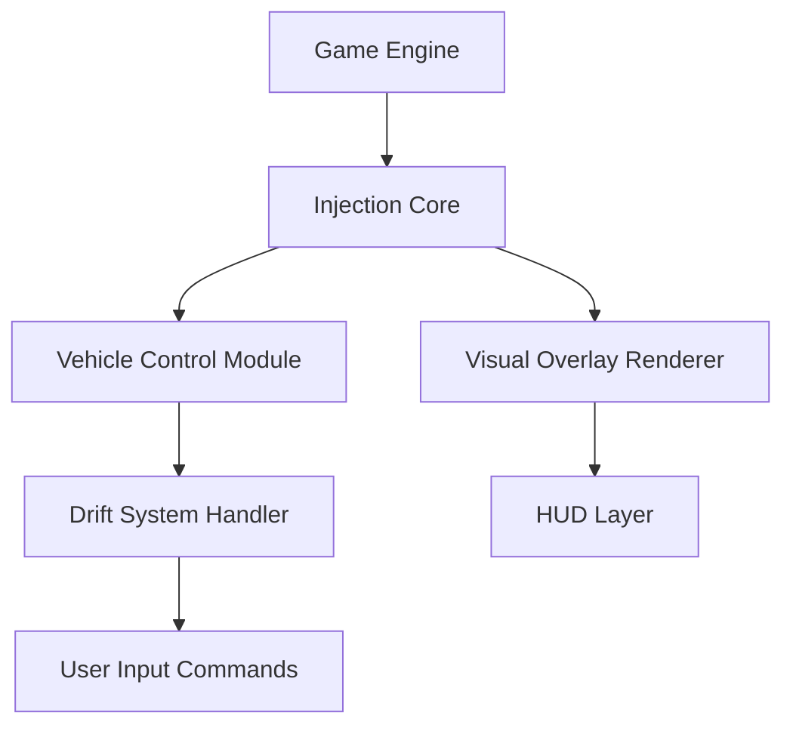

# Backseat Drivers Mod Menu 🚘

The **Backseat Drivers Mod Menu** gives you full creative control over how you race, boost, and coordinate with your team. Designed for flexibility and smooth real-time control, this in-game menu lets you toggle physics modifiers, driving assists, and UI overlays without restarting your session.

Whether you want cinematic replays, fine-tuned drift physics, or synchronized team boosts, this Mod Menu is your all-in-one control dashboard for mastering chaos and coordination alike.

---

## 🧭 Overview

This Mod Menu integrates seamlessly into *Backseat Drivers*, providing dynamic, on-screen control over your race environment and car performance. From drift stabilization to slow-motion cinematics, every setting can be modified mid-race — no restarts, no reloads, no downtime.

It’s the perfect solution for content creators, pro players, or anyone who wants to experiment with custom driving physics and visual enhancements.

[!IMPORTANT]

> All features are **session-based**. The Mod Menu does not permanently modify files or data — safe for offline and training use.

---

## ⚙️ Feature Highlights

* **🚗 Vehicle Parameter Control:** Adjust top speed, grip, and acceleration curves live.
* **🧠 Focus Mode Toggle:** Slow time for split-second reflex testing.
* **🔥 Cooldown Manager:** Instantly reset boosts, nitros, or team abilities.
* **🌀 Drift & Traction System:** Custom traction profiles for smoother turns.
* **🎥 Camera Tools:** Enable cinematic follow-cam and FOV zoom during replays.
* **🎮 Controller Sync:** Full gamepad navigation with vibration feedback indicators.

Example Mod Menu Configuration:

```ini
[MENU_CONFIG]
SpeedMultiplier=1.8
FocusMode=True
CooldownReset=True
DriftAssist=True
CameraFOV=85
HUD=True
```

[!NOTE]

> To create multiple profiles (Arcade, Drift, Simulation), duplicate this file under `/BackseatDrivers/mod_presets/`.

---

## 🧰 Setup Instructions

1. **Download** the verified Mod Menu build.
2. **Extract** into your *Backseat Drivers* installation directory.
3. **Run** `BackseatDrivers_ModMenu.exe` as Administrator.
4. **Launch the game**, then press `F1` to open the in-game overlay.
5. **Use arrow keys or mouse** to navigate, toggle, and edit sliders.

Command Example:

```bash
BackseatDrivers_ModMenu.exe /preset="DriftMaster.cfg"
```

[!WARNING]

> Do not run multiple overlay tools (FPS counters, other mods) simultaneously to avoid visual overlap.

---

## 💻 Compatibility

| Platform           | Status | Notes                            |
| ------------------ | ------ | -------------------------------- |
| Windows 10/11      | ✅      | Fully Supported                  |
| Steam Version      | ✅      | Auto-attach integration          |
| Epic Games Version | ✅      | Manual attach available          |
| Controller Support | ✅      | Overlay compatible               |
| Offline Mode       | ✅      | Works without network dependency |

Accessibility: Supports scalable text, dark/light mode, and high-contrast visuals for night maps.

---

## 🧩 Feature Architecture



---

## 🧠 Custom Presets

**Drift Master (Precision Handling)**

```ini
[PRESET_DRIFT]
SpeedMultiplier=1.6
DriftAssist=True
FocusMode=False
CooldownReset=False
CameraFOV=95
```

**Arcade Overdrive (Fast & Flashy)**

```ini
[PRESET_ARCADE]
SpeedMultiplier=2.3
DriftAssist=False
FocusMode=True
CooldownReset=True
CameraFOV=105
```

**Simulation Mode (Real Physics)**

```ini
[PRESET_SIMULATION]
SpeedMultiplier=1.0
DriftAssist=False
FocusMode=False
CooldownReset=False
CameraFOV=80
```

Switch presets instantly with `F2`, `F3`, and `F4`.

---

## 💬 FAQ

**Q: Does the Mod Menu work online?**
A: No, it’s designed for local and offline use only.

**Q: Can I use it with OBS or Streamlabs?**
A: Yes — it’s fully transparent and capture-safe for content creation.

**Q: How do I reset all settings?**
A: Press `CTRL + R` in the overlay to restore default values.

**Q: Does it support multiple monitors?**
A: Yes, dual-screen setups work seamlessly for HUD placement.

**Q: How often is it updated?**
A: Typically every 10–14 days with new patches and feature syncs.

---

## 🚀 Development Roadmap

| Version | Feature                     | Status     |
| ------- | --------------------------- | ---------- |
| v1.5    | Adaptive Drift Curve Engine | ✅ Released |
| v1.6    | Replay Cinematic Controls   | 🚧 Testing |
| v1.7    | AI Co-Pilot Voice Commands  | 🧩 Planned |

---

## 🏁 Final Thoughts

The **Backseat Drivers Mod Menu** is your personal control center — a modular, responsive overlay that lets you shape your racing world on your terms. From hyper-speed arcade mayhem to realistic drift physics, it delivers everything you need to refine, experiment, and dominate.

Unleash precision driving. Redefine control. Command every turn.

---
